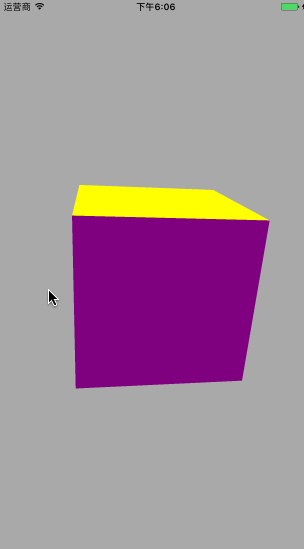

## ABOUT

SolidRotation is a 3D image operation.I realize it by using the **CATransform3D**

,which dealing with 3D effect, such as rotation, scaling, translation and other more，provided in iOS Api.

 **CATransform3D**:

- CATransform3DTranslate
- CATransform3DRotate
- CATransform3DInvert
- CATransform3DScale
- CATransform3DAffine

## Preview

## License

Released under the MIT license. See LICENSE for details.